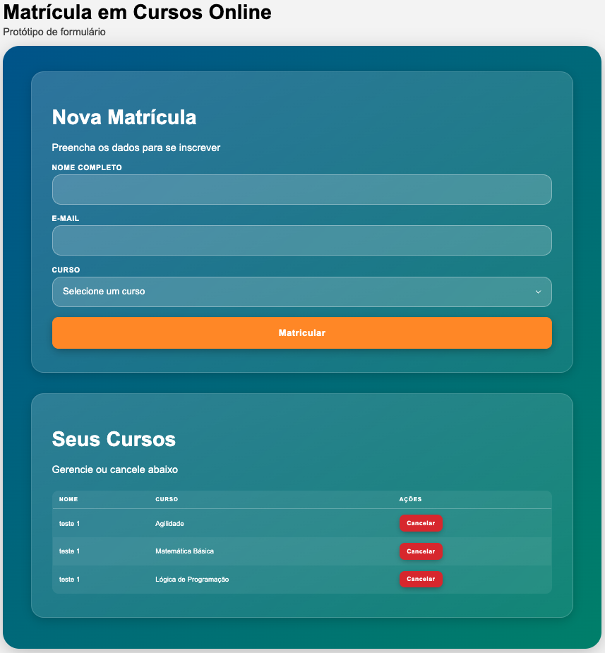

# Formulário de Matrícula em Cursos Online


> Protótipo acadêmico para aplicação dos conceitos de desenvolvimento integrado demonstrando um fluxo completo de inscrição e gestão de matrículas com validação em múltiplas camadas.

## Índice
- [Formulário de Matrícula em Cursos Online](#formulário-de-matrícula-em-cursos-online)
  - [Índice](#índice)
  - [Visão Geral](#visão-geral)
  - [Estrutura de Pastas](#estrutura-de-pastas)
  - [Endpoints (Backend)](#endpoints-backend)
  - [Fluxo de Validação](#fluxo-de-validação)
  - [Componentes Frontend](#componentes-frontend)
  - [Padrão de UI / Feedback](#padrão-de-ui--feedback)
  - [Decisões Técnicas Principais](#decisões-técnicas-principais)
  - [Como Executar](#como-executar)
  - [Fluxo de Uso](#fluxo-de-uso)
  - [Licença](#licença)


## Visão Geral
Aplicação full‑stack dividida em:
- Backend: Node.js + Express + TypeScript (armazenamento em memória para simplicidade).
- Frontend: Vue 2 (CLI) com componentes desacoplados para inscrição e gestão de matrículas.

## Estrutura de Pastas
```
backend/
    src/
        index.ts               # Bootstrap Express + middlewares
        routes/
            matriculas.ts      # Rotas (cursos, matrículas)
        validators/
            matriculaValidator.ts  # Regras e normalização de matrícula
        services/
            matriculaService.ts    # Operações sobre armazenamento
        data/
            cursos.ts          # Lista estática de cursos
            store.ts           # Estruturas em memória (matriculas)
    tsconfig.json              # Compilação TS -> dist/
    dist/                      # Saída JavaScript
frontend/
    src/
        main.js                # Bootstrap Vue + import CSS compartilhado
        App.vue                # Shell da aplicação
        assets/
            shared.css           # Estilos reutilizados (inputs, botões, tabela)
        utils/
            validacao.js         # Regras de validação reutilizáveis
        components/
            formulario/
                FormularioMatricula.vue   # Container (layout + orquestração)
            matricula/
                FormMatricula.vue         # Formulário de inscrição (emit events)
            gestao/
                GestaoMatriculas.vue      # Tabela + ações de cancelamento
```

## Endpoints (Backend)
| Método | Rota | Descrição | Corpo (request) | Respostas Principais |
|--------|------|-----------|-----------------|----------------------|
| GET    | `/cursos` | Lista cursos disponíveis | – | 200 `[ { id, nome } ]` |
| GET    | `/matriculas` | Lista matrículas registradas | – | 200 `[Matricula]` |
| POST   | `/matricula` | Cria matrícula | `{ nome, email, cursoId }` | 201 sucesso, 400 validação, 409 duplicada |
| DELETE | `/matriculas/:email/:cursoId` | Cancela matrícula | – | 200 removida, 404 inexistente |

`Matricula`: `{ nome: string; email: string; cursoId: number }`

## Fluxo de Validação
| Camada | Regras | Objetivo |
|--------|--------|----------|
| Frontend (utils/validacao.js) | nome obrigatório; email formato; curso selecionado; duplicidade local | Feedback imediato (UX) |
| Backend (POST /matricula) | Campos obrigatórios; regex e‑mail; curso existente; duplicidade global | Garantir integridade |
| Backend (DELETE) | Checa existência antes de remover | Consistência do estado |

## Componentes Frontend
| Componente | Papel | Eventos Emitidos | Depende de |
|------------|------|------------------|-----------|
| `FormMatricula.vue` | Captura dados e envia POST | `confirmado`, `atualizar` | `validacao.js`, fetch |
| `GestaoMatriculas.vue` | Lista e dispara intenção de cancelar | `solicitar-cancelamento`, `atualizar` (indireto após container) | fetch (via container) |
| `FormularioMatricula.vue` | Container: carrega dados, mostra alertas e modal, coordena cancelamento | – | fetch, filhos |

## Padrão de UI / Feedback
| Ação | Feedback Visual |
|------|-----------------|
| Matrícula criada | Alerta inline (verde) entre formulário e gestão |
| Erro de validação (form) | Mensagem abaixo do campo |
| Erro server POST | Alerta de erro no formulário |
| Cancelamento solicitado | Modal de confirmação customizada |
| Cancelamento confirmado | Alerta inline (vermelho) |

## Decisões Técnicas Principais
| Tema | Decisão | Justificativa |
|------|---------|--------------|
| Stack frontend | Vue 2 (CLI) | Compatibilidade com ambiente alvo e simplicidade |
| Armazenamento | In-memory arrays | Protótipo rápido sem persistência |
| Validação duplicada | Frente + servidor | Melhor UX + robustez |
| Estilos | CSS único compartilhado + scoped ad hoc | Reuso rápido sem overhead de pré-processador |
| Comunicação | fetch nativo | Menos dependências para protótipo estático |
| Modal | Implementação leve | Evitar dependência de lib externa |
| Modularização backend | Separação em routes / validators / services / data | Clareza didática |

## Como Executar
Pré‑requisito: Node.js >= 18 (arquivo `.nvmrc`).

```bash
# 1. Selecionar versão
nvm install
nvm use

# 2. Instalar dependências
make install

# 3. Subir backend
make backend

# 4. Em outro terminal subir frontend (porta 8080 padrão)
make frontend
```

## Fluxo de Uso
1. Abrir frontend em http://localhost:8080
2. Preencher formulário e clicar em matricular → exibe alerta verde confirma.
3. A matrícula aparece na seção “Seus Cursos”.
4. Ao clicar em cancelar → exibe modal de confirmação → exibe alerta vermelho após remoção.

## Licença
Projeto educacional / prototipagem (uso livre com atribuição).
